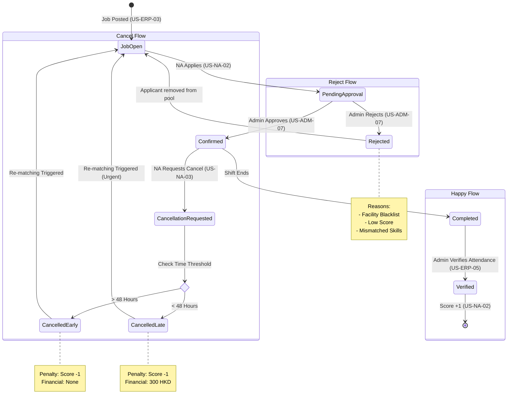

# Assignment State Diagrams

This document outlines the state transitions for the PHC Match/Dispatch System based on User Stories v1.1.

## State Diagram

## Flow Descriptions

### 1. Happy Flow (Standard Assignment)

1. **Job Open**: Job demand synced from ERP.
2. **Pending Approval**: NA applies via WhatsApp link/Portal. Status is `pending_approval`.
3. **Confirmed**: Admin screens and approves the application. Status becomes `confirmed`.
4. **Verified**: After shift, Admin verifies attendance. Score increases by 1.

### 2. Reject Flow (Screening)

1. **Pending Approval**: NA applies.
2. **Rejected**: Admin reviews application in "Job Applications Overview" (US-ADM-07).
   * If staff is on **Facility Blacklist** (checked against ERP data), Admin rejects.
   * If staff has **Low Score** or poor history, Admin rejects.
3. **Job Open**: The specific application is closed, but the job remains open for other candidates.

### 3. Cancel Flow (NA Cancellation)

1. **Confirmed**: Staff is assigned.
2. **Cancellation Requested**: Staff clicks "Cancel Shift" (US-NA-03).
3. **Logic Check**: System calculates time remaining.
   * **Early (>48h)**: Status `cancelled`. Score -1. No fine.
   * **Late (<48h)**: Status `cancelled`. Score -1. **300 HKD Fine**.
4. **Re-matching**: Job returns to `Job Open` pool. If late cancellation, it may be flagged as "Urgent" (US-ADM-05).
