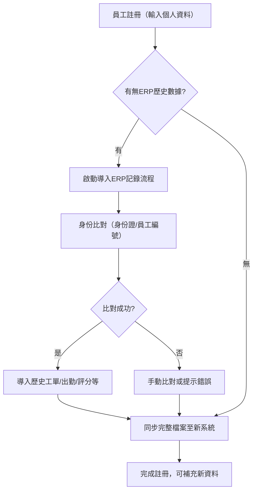

這裡是包含「從現有ERP導入（import）員工歷史工單記錄」子流程的註冊（Registration）流程設計，並以Mermaid TD格式作示意：

***

## Registration 流程（含ERP歷史資料導入）

### 步驟拆解

1. 員工註冊（新建帳戶、認證個人資料）
2. 檢查有無現有歷史記錄（ERP）
   - 如員工或管理員指定，此人有現成ERP工作紀錄
   - 啟動導入流程
3. ERP子流程 (NEW)：自ERP系統拉取歷史工單
   - 通過Identity mapping（如身份證/電話號／員工編號）對應
   - 抽取各項歷史數據（出勤、工齡、服務院舍、評分、證書等）
   - 匯入／匯總進新系統員工資料表
   - 顯示導入結果或錯誤（如比對失敗）
4. 將所有導入數據在新平台呈現（支持後續配對規則、偏好排序等）
5. 完成註冊，可選補充新資料或完善檔案

***

## Mermaid TD 流程圖

***

### 設計細節說明

- **ERP導入子流程**：建議可自動或人工trigger，例如註冊步驟給用戶選項“同步過過往ERP紀錄”，或管理員手動觸發
- **Identity 比對**：常用身分證、電話、舊有員工/工號做mapping，若失敗可人工補充或審查
- **導入資料類型**：建議涵蓋出勤歷史、院舍列表、積分評級、證書等，有利配對和公平排序
- **驗證流程**：若歷史資料混亂，可給員工機會查閱並反饋
- **註冊後補充**：員工可進一步完善新資料（如個人照片、現狀資歷）

***

如需詳列ERP資料欄位與接口格式、常見異常處理規則或API草圖，可隨時補充！

Sources
