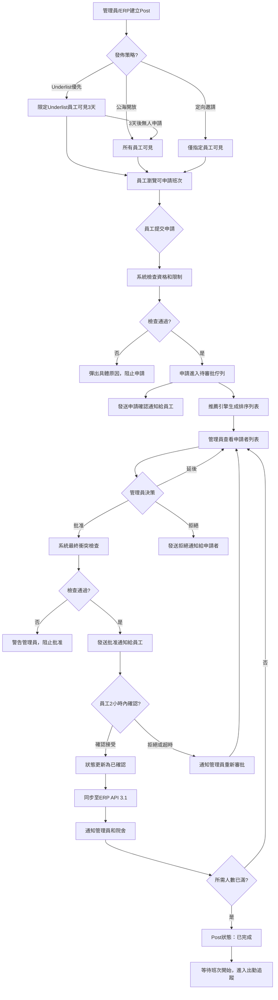

# Appendix B v1.5 - Job Posting Flow (Human Screening Workflow)

**Document Version:** 1.5  
**Date:** November 25, 2025  
**Status:** Updated for Human Screening Workflow  
**Replaces:** Appendix B (Automated Matching)

---

## 重要變更說明 (v1.5)

**工作流程典範轉移：**
- **舊版 (v1.4)：** 發佈Post → 系統自動配對 → 員工確認
- **新版 (v1.5)：** 發佈Post → 員工主動申請 → 管理員審批

**術語更新：**
- ~~「搶單」~~ → **「申請」** (Apply for Shift)
- ~~「配對」~~ → **「推薦」** (Recommend)
- ~~「確認分派」~~ → **「批准申請」** (Approve Application)

---

## Post (Job Posting / 申請制) 完整流程 v1.5

### 1. 建立與發佈 Post

#### 數據準備
- **來源：**
  - 院舍/管理端錄入需求於配對管理界面
  - 從ERP系統同步導入（GET /api/v1/jobs/demands - 每15分鐘輪詢）
  - 批量上載（Excel/CSV）

- **Post 資訊內容：**
  - 機構名稱和地點
  - 服務對象類型
  - 日期和時段（開始時間、結束時間）
  - 崗位類型（例：護理員、看護助理）
  - 所需人數（例：需要3人）
  - 特殊要求（證書、語言、經驗）
  - 薪資資訊
  - 聯絡人和電話
  - 備註說明

#### 院舍偏好配置
- **Underlist 設定：**
  - 系統自動從ERP拉取該院舍的「優先名單」
  - 曾在本院服務過的員工列表
  - 可設定「僅限Underlist申請」或「Underlist優先，公海次之」

- **其他偏好：**
  - 黑名單（禁止申請）
  - 白名單（特別邀請）
  - 證書要求（例：必須有急救證書）
  - 特殊限制（性別、年齡、語言能力）

#### 生成 Post 清單
- 每一條工作需求對應一條Post記錄
- Post 狀態：待發佈 → 已發佈 → 申請中 → 已額滿 → 已確認 → 已完成

---

### 2. 發佈策略選擇 (v1.5 - 申請制)

#### A. Underlist 優先發佈
- **適用場景：** 院舍指定「優先給熟悉員工」
- **流程：**
  1. Post僅向Underlist員工顯示（其他員工不可見）
  2. 限定時間內（例：3天）僅Underlist可申請
  3. 系統發送通知給所有Underlist員工：「新班次可申請（優先開放）」
  4. Underlist員工可瀏覽並申請
  5. 超時未額滿 → 自動開放至公海

#### B. 公海開放發佈
- **適用場景：** 院舍無特殊偏好，或緊急需求
- **流程：**
  1. Post立即向所有符合基本條件的員工顯示
  2. 系統發送通知：「新班次可申請」
  3. 所有員工可瀏覽並申請

#### C. 定向邀請
- **適用場景：** 院舍指定特定員工（白名單）
- **流程：**
  1. 管理員手動選擇特定員工
  2. 系統發送「邀請申請」通知給指定員工
  3. 僅被邀請員工可見該Post
  4. 超時未申請 → 可選擇開放至Underlist或公海

---

### 3. 員工端瀏覽與申請 (v1.5 NEW)

#### 瀏覽介面
- **可申請班次列表：**
  - 顯示所有符合員工資格的Post
  - 按條件分組/篩選：
    - 地區（HKI / KLN / NT）
    - 日期範圍
    - 時段（日班/夜班）
    - 崗位類型
  - 排序選項：
    - 最新發佈
    - 開始時間
    - 薪資（由高至低）
    - 距離（未來功能）

- **Post 卡片顯示：**
  - 院舍名稱、地點
  - 日期、時段
  - 薪資
  - 特殊標記：
    - 🏆 Underlist優先（你曾服務本院）
    - ⚡ 緊急需求
    - 📋 需特殊證書
  - 已申請人數 / 所需人數（例：5人申請 / 需要3人）
  - 申請截止時間

#### 申請操作
- **一鍵申請：**
  - 員工點擊「申請」按鈕
  - 系統即時檢查：
    1. **時間衝突：** 該時段是否已有其他已確認班次
    2. **數量上限：** 已申請/已接受班次是否達到5個上限
    3. **黑名單：** 是否被該院舍列入黑名單
    4. **證書要求：** 是否符合特殊證書要求
    5. **資格條件：** 是否符合其他條件（如語言、經驗）

- **檢查結果：**
  - **通過：** 申請提交成功
    - 顯示「申請已提交，等待審批」
    - 發送申請確認通知
    - Post狀態顯示「已申請」
  - **失敗：** 彈出具體原因
    - 「時間衝突：你已接受 {時間} 的班次」
    - 「已達上限：你已有5個待確認/已確認班次」
    - 「不符資格：需要 {證書名稱}」
    - 「黑名單：無法申請該院舍班次」

#### 申請管理
- **我的申請列表：**
  - 狀態分類：
    - 待審批（黃色）
    - 已批准待確認（藍色）
    - 已確認（綠色）
    - 已拒絕（灰色）
    - 已過期（灰色）
  - 可操作：
    - 取消申請（待審批狀態）
    - 確認接受（已批准狀態）
    - 查看詳情
    - 查看拒絕原因

---

### 4. 管理員審批與派單 (v1.5 NEW - 核心流程)

#### 審批介面
- **待審批列表：**
  - 按Post分組顯示所有待審批申請
  - 緊急程度標記（距離開始時間）
  - 每個Post顯示：
    - Post詳情（時間、地點、需要人數）
    - 申請人數（例：8人申請，需要3人）
    - 推薦排名（系統推薦引擎生成）

#### 查看申請者（單個Post）
- **申請者列表：**
  - 自動按推薦算法排序：
    1. Underlist成員（標記🏆）
    2. 分數由高至低
    3. 已接受班次數由少至多
    4. 申請時間（先到先得可選）

- **申請者資訊卡：**
  - 姓名、照片
  - 推薦排名：#1, #2, #3...
  - 當前分數：例如 52分
  - Underlist標記：✓ 曾服務本院（顯示最後服務日期）
  - 已接受班次：2/5
  - 歷史出勤率：95%
  - 最近評價：⭐⭐⭐⭐⭐
  - 證書狀態：✓ 全部有效
  - 申請時間：2025-11-25 10:30

#### 批准操作
- **選擇批准對象：**
  - 勾選需要的申請者（數量 = Post所需人數）
  - 可批准推薦排名最高者（一鍵批准）
  - 可根據特殊需求選擇其他申請者

- **批准前最終檢查：**
  - 系統自動驗證：
    - 員工仍然可用（無新衝突）
    - 未超過5個班次上限
    - 證書未過期
  - 如有問題，彈出警告並阻止批准

- **批准確認：**
  - 選擇批准理由（可選）：
    - 推薦排名最高
    - Underlist優先
    - 特殊技能匹配
    - 緊急需要
  - 填寫備註（可選）
  - 點擊「確認批准」

#### 批准後處理
- **發送批准通知：**
  - 被批准員工收到WhatsApp + Web Push通知
  - 通知內容：
    - 「恭喜！你的申請已獲批准」
    - Post詳情（日期、時間、地點、聯絡人）
    - 特殊備註和注意事項
    - **確認連結**（員工需在2小時內確認）

- **更新Post狀態：**
  - 如需要3人，批准3人後 → 狀態更新為「待確認」
  - 如所有批准者確認 → 狀態更新為「已額滿」
  - 剩餘未批准申請自動標記為「已過期」，發送通知

- **同步至ERP：**
  - 員工確認後，調用 API 3.1 (POST /api/v1/jobs/assignments)
  - 提交assignment記錄至ERP

#### 拒絕操作
- **批量拒絕：**
  - 勾選不合適的申請者
  - 選擇拒絕原因（可選）：
    - 有更合適人選
    - 資格不完全符合
    - 時間安排考量
  - 點擊「批量拒絕」

- **拒絕通知：**
  - 被拒絕員工收到通知：「申請未通過」
  - 可顯示原因（如管理員填寫）
  - 提示：可申請其他班次

---

### 5. 員工確認與結案

#### 確認流程
- **批准後2小時確認窗口：**
  - 員工收到批准通知，點擊確認連結
  - 進入確認介面，查看完整班次資訊
  - 選擇：
    - **確認接受：** 正式接受該班次
    - **拒絕：** 填寫原因（如臨時有事）

- **確認後處理：**
  - **如確認接受：**
    - Post狀態更新為「已確認」
    - 發送確認通知給管理員和院舍
    - 同步至ERP（API 3.1）
    - 員工「已接受班次數」+1
  - **如拒絕或超時：**
    - 通知管理員
    - Post重新進入「待審批」
    - 管理員可批准下一位申請者

#### 流程結案
- 所有所需人數已確認 → Post狀態「已完成」
- 等待班次開始，進入出勤追蹤流程（FR-6）

---

### 6. 特殊處理與補位機制

#### 取消與補位
- **員工取消已確認班次：**
  - 如距離開始時間 > 48小時：
    - 僅扣1分（無罰款）
    - Post自動重新開放申請或審批下一位
  - 如距離開始時間 < 48小時：
    - 扣1分 + 罰款300 HKD
    - 彈出警告確認
    - Post緊急重新開放申請

- **自動補位流程：**
  1. 通知原有其他申請者（如仍符合條件）
  2. 管理員可快速審批候補人選
  3. 或重新發佈至公海

#### 緊急派發
- **場景：** 臨近開始時間仍未額滿
- **操作：**
  - 管理員使用「緊急派發」功能
  - 直接指派給特定員工（跳過申請流程）
  - 系統發送緊急通知
  - 需填寫緊急原因（審計用途）

#### 階段性開放
- **場景：** Underlist階段無人申請
- **自動流程：**
  - Underlist限定期（例3天）到期
  - 系統自動將Post開放至公海
  - 發送通知給所有符合條件員工

---

## 流程示意圖 v1.5 (申請制，Mermaid TD)

---

## v1.5 與 v1.4 Post Flow 對比

| 環節 | v1.4 (舊版) | v1.5 (新版) |
|------|-----------|-----------|
| **發佈後員工行為** | 等待系統分派 | 主動瀏覽並申請 |
| **配對/推薦** | 系統自動配對並分派 | 系統推薦排序，管理員決策 |
| **員工通知** | "你已被分派至..." | "新班次可申請" → "申請已批准" |
| **管理員角色** | 監控異常、手動調整 | 審批所有申請（核心決策） |
| **公平分配** | 系統自動執行規則 | 管理員參考推薦人工控制 |
| **緊急處理** | 系統重新配對 | 緊急派發功能 |
| **術語** | 搶單、配對、確認分派 | 申請、推薦、批准申請 |

---

## 小結 / 設計要點 v1.5

### 核心原則
- **員工主動性：** 員工掌握申請哪些班次的選擇權
- **管理員控制：** 所有分派決定由管理員人工審批
- **系統輔助：** 推薦引擎提供智能排序，減輕審批負擔
- **靈活性：** 支持多種發佈策略（Underlist、公海、定向）

### 流程優勢
- **透明度高：** 員工清楚知道申請狀態和結果
- **公平性佳：** 推薦算法考量多重因素（分數、Underlist、公平分配）
- **彈性大：** 管理員可根據特殊情況做最終決定
- **可追溯：** 所有申請、批准、拒絕記錄完整留存

### 實施挑戰與緩解
| 挑戰 | 緩解措施 |
|------|---------|
| 管理員審批工作量大 | 推薦引擎排序、批次批准、緊急派發快速通道 |
| 員工申請競爭激烈 | 推薦算法公平分配考量、Underlist優先機制 |
| 審批延遲影響效率 | 申請確認通知、管理員提醒、階段性自動開放 |
| 員工不熟悉新流程 | 清晰介面設計、申請狀態追蹤、拒絕原因說明 |

### 適用場景
- ✅ **適合：** 重視人工判斷、需要靈活調度、管理員需掌控全局
- ✅ **適合：** 院舍偏好明確（Underlist、特殊要求）
- ✅ **適合：** 員工希望更多選擇權和透明度
- ⚠️ **需注意：** 大量班次時管理員審批壓力（可使用批次功能）

---

## 實施建議

### Phase 1: 核心功能（Week 1-4）
- [ ] Post發佈介面（支持Underlist/公海/定向）
- [ ] 員工瀏覽和申請介面
- [ ] 管理員審批介面（基礎版）
- [ ] 推薦排序引擎
- [ ] 通知流程（申請、批准、拒絕、確認）
- [ ] ERP同步（API 3.1）

### Phase 2: 進階功能（Week 5-8）
- [ ] 批次批准操作
- [ ] 緊急派發功能
- [ ] 階段性自動開放（Underlist → 公海）
- [ ] 申請歷史追蹤和統計
- [ ] 管理員決策報表

### Phase 3: 優化（Week 9-12）
- [ ] 高級過濾和搜尋
- [ ] 移動端優化
- [ ] 推薦算法優化（機器學習）
- [ ] 自動提醒功能（管理員/員工）
- [ ] 半自動批准選項（可選）

### 測試重點
- [ ] 並發申請處理（多人同時申請同一Post）
- [ ] 時間衝突檢查準確性
- [ ] 5個班次上限強制執行
- [ ] 推薦排序算法正確性
- [ ] 通知送達率和及時性
- [ ] ERP同步成功率

---

**文件狀態：** ✅ 已完成 v1.5 更新  
**與 PRD 對齊：** ✓ 符合 Product Specification Document v1.5  
**與 Appendix C 對齊：** ✓ 銜接 Application & Screening Flow v1.5  
**最後更新：** 2025年11月25日
