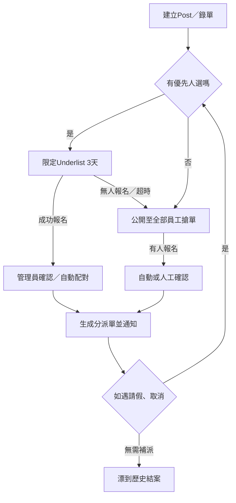

根據你提供的逐字稿和上下文，下面是針對「Post（Job Posting／配對）」的全流程（flow）整理與重點步驟拆解，涵蓋由院舍/管理端發佈、員工端搶單或配對到最終確認、特例處理等狀態分流。  
此「Post Flow」結合了自動化（全自動發佈）、半自動置頂指派與公海搶單等多種實戰情境。

***

## Post（Job Posting／配對）完整流程

### 1. 建立與發佈 Post

- **數據準備**
  - 由院舍／管理端錄入需求（資料包括：機構、服務對象、日期時段、崗位類型、特殊要求等）於配對管理界面
  - 系統可從ERP、自家表單或人工數據同步導入

- **生成 Post 清單**
  - 每一條「工作需求」（order／班次空缺）對應一條可配對的Post
  - 一次可批量上載多個班次（如整個月）

### 2. 配對機制選擇（策略分流）

- **優先群組派發（Targeted Assign / Underlist）**
  - 系統先檢索歷史配對紀錄，自動篩選出有相關經驗或設為優先（如17個曾服務本院舍的員工）
  - 由這群人優先接收該Post，限定時間內（如3天或xx%總時段）只向這批人開放

- **全員搶單（Open to All / 公海）**
  - 當優先群組無人報名，或超時未配對成功，自動將該Post開放至全體員工App／公海列表
  - 員工根據地區、時間、職種等條件主動搶單或申請

- **自動或人工指定**
  - 如遇指定特殊條件（如需證書、體檢等），後台批次或人工選擇「最適合」人選直派

### 3. 員工端體驗

- **搶單／申請／確認**
  - 員工可於App/Web端查看可配對Post清單（按條件分組，可搜尋/快速篩選）
  - 一鍵「報名」或搶單，可設最多同時報名X條街
  - 支援顯示註意事項、崗位地點、工資、服務對象及圖文附件

- **動態狀態管理**
  - 是否先到先得（先搶先中）、還是有一段「預選」期收集多個候選後由系統/管理員批配給最高分／最合適的候選
  - 如遇超時、缺人，會自動放入下一輪公海

### 4. 管理員／後台操作

- **配對確認與派單**
  - 重點人選申請後，管理端可人工或根據積分/規則自動確定錄用對象
  - 確定後，產生「分派單」（Assignment）並通知員工及院舍

- **通知與追蹤**
  - 支援Whatsapp/Email/App通知中標或配對成功員工；同時告知院舍人選安排
  - 未匹配上崗的單據，維持在「待處理」／「公開」列表以待補派

### 5. 特殊處理與例外分流

- **優先與限制組**
  - 某些院舍要求「只用翻過這間院的員工」，會有Underlist邏輯，普通員工不會見到該單
  - 可設限制最多同時申請N單／N家院舍，避免惡性搶單

- **自動派發與補位機制**
  - 如自動配對後缺人，自動再派至候補、最後公海
  - 當員工取消或請假，系統自動重新流轉派單（參考前述Cancel Flow）

***

## 流程示意圖（概述）

***

## 小結/設計要點

- 整個Post flow支持全自動、半自動和人工輔助配對，滿足不同院舍和員工需求  
- 多渠道通知+分層（專屬→公海）分流，提升效率又保留靈活人手調配
- 積分／懲罰與記錄串聯（如遲到、臨時請假自動重新Post）
- Cancel與Post flow關聯緊密（避免重複與遺漏）

如需API建議、UI原型圖或細節表格可進一步提供。

Sources
