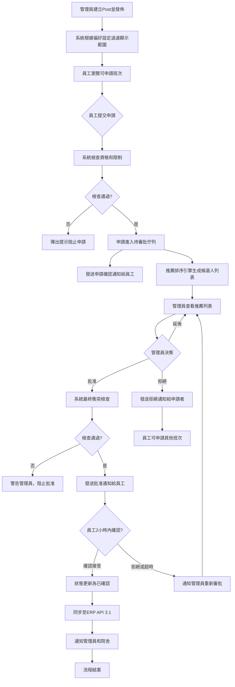

# Appendix C v1.5 - Application & Screening Flow (Human Screening Workflow)

**Document Version:** 1.5  
**Date:** November 25, 2025  
**Status:** Updated for Human Screening Workflow  
**Replaces:** Appendix Cv1 (Automated Matching)

---

## 重要變更說明 (v1.5)

**工作流程典範轉移：**
- **舊版 (v1.4)：** 系統自動配對 → 員工確認/拒絕 → 自動重新配對
- **新版 (v1.5)：** 員工主動申請 → 管理員人工審批 → 管理員批准 → 員工確認

**核心改變：**
1. **員工行為：** 從「確認系統分派」改為「主動申請班次」
2. **管理員角色：** 從「監控異常」改為「審批申請」
3. **FR-2 配對引擎：** 從「自動分派」改為「推薦排序引擎」（輔助管理員決策）
4. **通知流程：** 新增「申請確認」、「申請批准/拒絕」通知

---

## 院舍 Preference Configuration 整合 Application & Screening Flow (v1.5)

### 0. 院舍偏好設定階段

- **偏好配置內容**
  - 院舍可預先於系統設定人選條件，如：
    - 僅限曾於本院服務過的人員（underlist）
    - 指定員工黑名單或白名單
    - 指定證書／體檢紀錄／資歷門檻
    - 限每人同時接單數（最多5個）
    - **v1.5:** 人工審核分派規則（必須經管理員批准）
    - 特殊限制（例：性別、年齡、語言、連續天數等）
- **偏好設定影響後續顯示範圍和申請資格**

---

### 1. 建立與發佈 Post（含院舍配置）

- 院舍端/管理員於系統建立新Post時同步套用偏好條件
- Post包含：機構、日期時段、崗位類型、特殊要求、薪資等
- 如未設特殊偏好，系統將以預設邏輯（優先名單＋公海）

---

### 2. 員工瀏覽與申請 (v1.5 NEW)

**員工端體驗：**

- **瀏覽可申請班次**
  - 員工可於App/Web端瀏覽所有符合資格的Post
  - 系統根據院舍偏好設定過濾顯示範圍：
    - **有偏好限制：** 只顯示給合資格人員（underlist、whitelist）
    - **無偏好/開放：** 顯示給所有員工（公海）
  - 不符合條件的員工不可見該Post

- **提交申請**
  - 員工一鍵「申請」班次
  - 系統即時檢查：
    - 已申請/已接受班次數量（不超過5個）
    - 時間衝突檢查（該時段已有其他班次）
    - 黑名單檢查
    - 證書有效期檢查
  - 如違反規則，彈出提示並阻止申請
  - 申請成功後，進入「待審批」狀態

- **申請確認通知**
  - 員工收到「申請已提交」確認通知
  - 可於個人介面查看所有申請狀態

---

### 3. 推薦排序引擎 (v1.5 - FR-2 重新定義)

**系統輔助功能（不自動分派）：**

- **推薦算法**
  - 系統根據配對規則對所有申請者進行排序：
    1. **Underlist 優先**（曾在該院舍服務過的員工）
    2. **分數排序**（由高至低）
    3. **可用性驗證**（無時間衝突）
    4. **證書有效性**
    5. **公平分配考量**（已接受班次較少者優先）

- **推薦列表生成**
  - 系統生成「推薦候選人列表」供管理員參考
  - 顯示每位申請者的：
    - 分數（當前積分）
    - Underlist 標記（✓ 曾服務本院）
    - 已接受班次數量（例：3/5）
    - 歷史出勤率
    - 證書狀態
    - 上次服務日期

- **重要：推薦不等於分派**
  - 系統**不會**自動分派
  - 所有決定由管理員人工審批

---

### 4. 管理員審批流程 (v1.5 NEW - 核心步驟)

**管理端操作：**

- **審批介面**
  - 管理員進入「待審批申請」介面
  - 查看該Post的所有申請者列表（已按推薦算法排序）
  - 介面顯示：
    - 申請者姓名、照片
    - 推薦排名（#1, #2, #3...）
    - 分數、Underlist標記
    - 已接受班次數 / 上限
    - 歷史評價
    - 申請時間

- **人工決策**
  - 管理員逐一審查申請者資格
  - 可以：
    - **批准**某位申請者（產生分派單）
    - **拒絕**某位或所有申請者
    - **延後決定**（保持待審批狀態）
  - 批准時需選擇理由（可選）：
    - 推薦排名最高
    - Underlist 優先
    - 特殊需求匹配
    - 緊急需要

- **批次操作**
  - 如一個Post需要多位員工（例：需要3人），管理員可批准前3位
  - 系統自動檢查批准數量不超過需求

- **衝突檢查**
  - 管理員批准前，系統最終驗證：
    - 員工仍然可用（無時間衝突）
    - 未超過5個班次上限
    - 證書仍然有效
  - 如有衝突，彈出警告並阻止批准

---

### 5. 批准通知與員工確認 (v1.5 UPDATED)

**批准後流程：**

- **發送批准通知**
  - 被批准的員工收到「申請已批准」通知（WhatsApp + Web Push）
  - 通知內容包含：
    - 班次詳情（日期、時間、地點）
    - 聯絡人資訊
    - 特殊備註
    - **確認連結**（員工需最終確認接受）

- **員工最終確認**
  - 員工點擊確認連結，進入確認介面
  - 可以：
    - **確認接受**（狀態 → 已確認）
    - **拒絕**（需填寫原因）
  - 確認時限：2小時內（可配置）

- **確認結果處理**
  - **如員工確認：**
    - 狀態更新為「已確認」
    - 發送通知給管理員和院舍
    - 同步至ERP系統（API 3.1）
  - **如員工拒絕或超時：**
    - 狀態更新為「已拒絕」或「超時未確認」
    - 通知管理員重新審批下一位申請者
    - 該Post重新進入待審批佇列

---

### 6. 未批准申請者處理

- **拒絕通知**
  - 被拒絕的申請者收到「申請未通過」通知
  - 可包含原因（可選）：
    - 有更合適人選
    - 時間衝突
    - 資格不符
  - 員工可申請其他班次

- **自動過期**
  - 如Post已被其他人接受，剩餘申請自動標記為「已過期」
  - 員工收到通知：「該班次已額滿」

---

### 7. 補派機制 (v1.5)

- **重新開放申請**
  - 如被批准員工拒絕或取消，Post重新開放申請
  - 系統通知原有申請者（如仍符合條件）
  - 管理員可重新審批

- **緊急派發**
  - 如臨近班次開始時間，管理員可使用「緊急派發」功能
  - 直接指派給特定員工（跳過申請流程）
  - 需填寫緊急原因

---

## Flow Diagram v1.5 (人工審批流程，Mermaid TD)

---

## v1.5 與 v1.4 流程對比

| 步驟 | v1.4 (舊版 - 自動配對) | v1.5 (新版 - 人工審批) |
|------|----------------------|----------------------|
| **員工行為** | 等待系統分派 → 確認/拒絕 | 主動瀏覽 → 提交申請 |
| **系統角色** | 自動配對分派 | 推薦排序（輔助決策） |
| **管理員角色** | 監控異常 | 審批申請（核心決策者） |
| **通知類型** | "你已被分派" | "申請已收到" → "申請已批准" |
| **FR-2 定義** | 自動分派引擎 | 推薦排序引擎 |
| **API 3.1 觸發** | 系統配對完成 | 管理員批准操作 |
| **公平分配** | 系統自動執行 | 管理員人工控制 |

---

## 特別補充說明 v1.5

### 優勢
- **管理員完全控制**：所有分派決定由人工審批，符合現行操作習慣
- **靈活性高**：管理員可根據特殊情況（如緊急需求、員工特殊技能）做決定
- **透明度**：員工清楚知道申請狀態（待審批、已批准、已拒絕）
- **推薦輔助**：系統提供智能推薦，減輕管理員篩選負擔

### 挑戰與緩解
- **挑戰：** 人工審批可能造成延遲
  - **緩解：** 推薦引擎提供快速決策參考，批次批准功能
- **挑戰：** 管理員工作量增加
  - **緩解：** 智能推薦、批次操作、緊急派發快速通道
- **挑戰：** 員工申請競爭激烈班次
  - **緩解：** 推薦算法考量公平分配（已接受班次數）

### 適用場景
- **適合：** 重視人工判斷、特殊需求多、管理員需掌控全局
- **不適合：** 大量班次需快速分派、管理員人手不足
- **未來演進：** 可考慮「半自動模式」（管理員可選擇自動批准高分數申請者）

---

## 實施建議

### Phase 1: 基礎功能（Week 1-4）
1. 員工瀏覽和申請介面
2. 管理員審批介面（基礎版）
3. 推薦排序引擎（FR-2 重構）
4. 通知流程（申請、批准、拒絕）

### Phase 2: 進階功能（Week 5-8）
1. 批次批准操作
2. 緊急派發功能
3. 高級過濾和搜尋（管理員介面）
4. 申請歷史追蹤和分析

### Phase 3: 優化（Week 9-12）
1. 管理員決策輔助（顯示更多數據）
2. 自動提醒管理員（有待審批申請）
3. 半自動批准選項（可選功能）
4. 移動端優化

---

**文件狀態：** ✅ 已完成 v1.5 更新  
**與 PRD 對齊：** ✓ 符合 Product Specification Document v1.5  
**數據流程圖對齊：** ✓ 符合 dataflow-phc-erp-integration.excalidraw  
**最後更新：** 2025年11月25日
