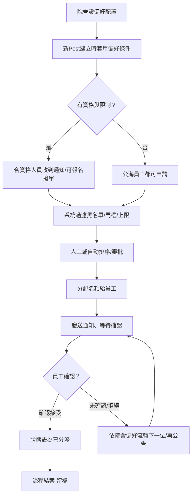

以下是把「院舍 preference configuration（院舍偏好／條件設定）」納入 Matching & Confirmation 流程後的細化說明與全新流程圖：

***

## 院舍 Preference Configuration 整合 Matching & Confirmation Flow

### 0. 院舍偏好設定階段

- **偏好配置內容**
  - 院舍可預先於系統設定人選條件，如：
    - 僅限曾於本院服務過的人員（underlist）
    - 指定員工黑名單或白名單
    - 指定證書／體檢紀錄／資歷門檻
    - 限每人同時接單數
    - 可設定先到先得或人工審核分派規則
    - 特殊限制（例：性別、年齡、語言、連續天數等）
- **偏好設定影響後續配對和同意機制**

### 1. 建立與發佈 Post（含院舍配置）

- 院舍端於建立新Post時同步套用自身偏好條件
- 如未設特殊偏好，系統將以預設邏輯（優先名單＋公海）

### 2. 配對範圍與申請入口

- **有偏好限制：**
  - 只顯示給合資格人員（篩選after preference）
  - 初步僅通知underlist、whitelist或特定屬性人員
  - 其他員工不可見／不可報名
- **無偏好／開放：**
  - 先按優先名單推送，無人報名則向公海開放

### 3. 員工申請/搶單及管理端審批

- 合資格員工可報名或一鍵搶單
- 超過限定數量、資格不足、黑名單等會彈出提示不可申請
- 系統自動根據分數、先到、人工審批等偏好自動或手動分配

### 4. 確認及下一步

- 中選員工收到通知，需「確認接受」
- 系統自動記錄配對及確認歷史，支援後續取消／補派等處理
- 若該崗位專屬限制設定且配對失敗，系統自動循環於該邊界人群內或提昇放公海（根據院舍規則）

***

## Flow Diagram (含Preference配置，Mermaid TD)

***

### 特別補充說明

- **偏好配置決定曝光範圍和搶單行為**：任何不符條件員工皆見不到該單／不能搶
- **可階段流轉**：如三天院舍內部限制範圍無人報名，才自動開放至全公司／公海
- **偏好可隨院舍自定義，支持預設與臨時調整**（如需緊急開放）
- **配置與配對全留痕，方便日後審核、調查、績效統計**

如需範例UI、API草圖、或特殊偏好情境的流程demo，歡迎補充需求。

Sources

