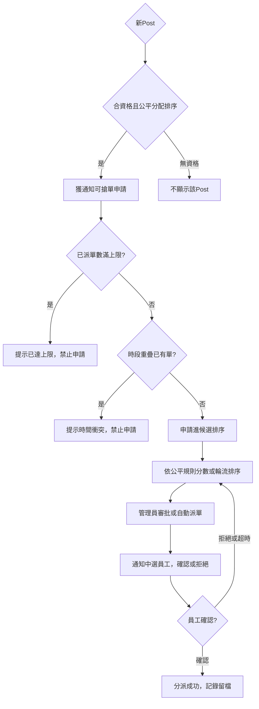

以下是將「公平分配（Fair Sharing）」和「衝突檢查（Conflict Avoidance）」兩大偏好，**直接整合進 Matching & Confirmation Flow** 的完整修正版細節與 Mermaid TD流程圖：

***

## Matching & Confirmation + Fair Sharing & Conflict Avoidance 流程

### 0. 院舍偏好設置（新增公平/衝突）

- 院舍於偏好設置層級可啟用：
  - 「平均分派」：規定每名員工每月/每週最大接單數量，或輪流推單
  - 「避免工作衝突」：自動檢查員工申請、被配對前有否相關時段衝突，禁止重複申請/分派
  - 「優先群組、黑白名單、特殊條件」：如過往

### 1. 建立新Post時套用所有偏好

- 系統套用資格篩選、黑名單
- 高級偏好啟用下，同步檢查該員工今期已得單數、當前時段是否已被Block

### 2. 配對目標群組及Fair Sharing

- 有 underlist/whitelist，Post先限定給遠社優先名單
- 配對時輪流/平均算法推送（根據累積單數、自定公平規則，優先通知分得較少的員工）
- 若皆拒絕或超時，開放至全員（仍套用公平排序算法）

### 3. 員工端&系統客觀檢查

- 員工申請/搶單時，系統同時檢查
  - 當月已派單數是否已滿
  - 所申請單與既有單時段是否重疊（Overlap冲突即彈出提示、拒絕申請）
  - 資格、證書、黑白名單等其他條件

### 4. 管理員審批與確認

- 多名候選時，人工可參考「公平累積分數、接單輪序、歷史評分」排序指派
- 可指定自動（最公平均分派自動中配）或強制人工選擇

### 5. 確認&補位機制

- 配對員工收到通知，需確認接受
- 若拒絕/超時，系統遵循公平分派+衝突避免邏輯自動流轉候補或開放全員（再次按公平規則推送）

### 6. 資料留痕、周期統計

- 所有配對、申請失敗（如衝突、上限）皆記錄於歷史，方便審核與下月調整公平參數

***

## Mermaid TD 流程圖

***

### 必備要點總結

- **公平機制與衝突檢查融合於每一層**，任何違規即時阻擋，確保分配公道與無重疊。
- **所有申請與系統回應留痕**，方便審核、查詢及客訴處理。
- **動態可配置**：不同院舍自定公平策略、限制與例外情境。
- **全過程員工端透明可查**：自己接單歷史、剩餘可申請數、失敗原因。

如需更具體的參數配置範例、排序算法細節或UI介面示意，歡迎追問！

Sources
