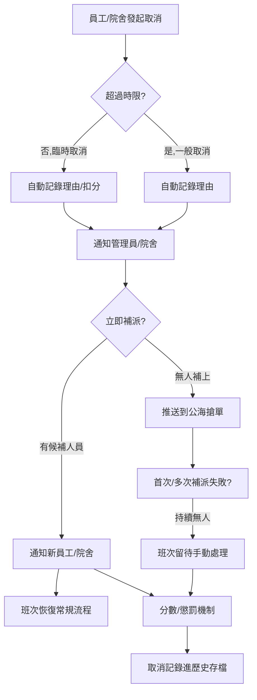

以下是根據逐字稿細節製作的「Cancellation（取消／請假）Flow」完整版本，包括流程標準步驟、關鍵狀態、例外補充與視覺化流程圖：

***

## Cancellation（取消／請假）Flow

### 1. 取消觸發與請求來源

- 員工（護理員/姐姐）因事請假、個人原因App/Web/Whatsapp主動操作
- 院舍/管理員因排班異動或突發情況主動發起
- 可處理不同時間點 —— 例如48小時內屬於「臨時」；48小時外屬「一般」請假取消

### 2. 前端/系統操作

- 員工進入App/Web，於「我的工作」或「排班」點擊「取消」或「請假」按鈕
- 可填寫取消原因（選填/備註）
- 軟體層自動驗證（是否超過時限、是否允許取消）

### 3. 狀態流轉與記錄

- 系統收到取消請求，將該班次/Order狀態轉為「取消待處理」
- 自動記錄取消人、時間、原因等
- 系統根據規則自動判斷是否扣分/警告（如48小時內取消、自動/手動觸發處罰）

### 4. 通知與補派機制

- 通知管理員/院舍工作被取消需補人
- 系統自動推送該缺失班次給優先群組或公海（open pool）員工搶單
- 新人選補位後即時通知雙方（可App推播+Whatsapp/Email）

### 5. 分數與權益機制

- 系統根據取消情形自動進行扣分、懲罰（如次數過多暫停搶單資格）
- 管理員異議審核後可人工調整分數或恢復權益

### 6. 歷史資料／查詢及留痕

- 已取消班次進「歷史」或「取消」列表留存
- 方便日後監察、爭議澄清、績效統計

### 7. 例外／特殊情況補充

- 院舍整天關閉或排班集中異動時，由管理員批量取消、批量推送補上
- 雙方均可查詢取消紀錄與處理情況

***

## Flow Diagram

***

## 補充註解與系統設計重點

- 可在前端限制取消按鈕顯示（臨近上班幾小時內消失/變為申請審批）
- 每次取消都會被計錄，並對應可扣分或限制搶單機會（積分制/黑名單機制整合）
- 通知機制應多渠道同步（App、Email、Whatsapp等），避免管理死角
- 補位推送機制支持多階層：優先人選→全員公海

如需API設計/界面原型視覺化，可進一步補充。

Sources
