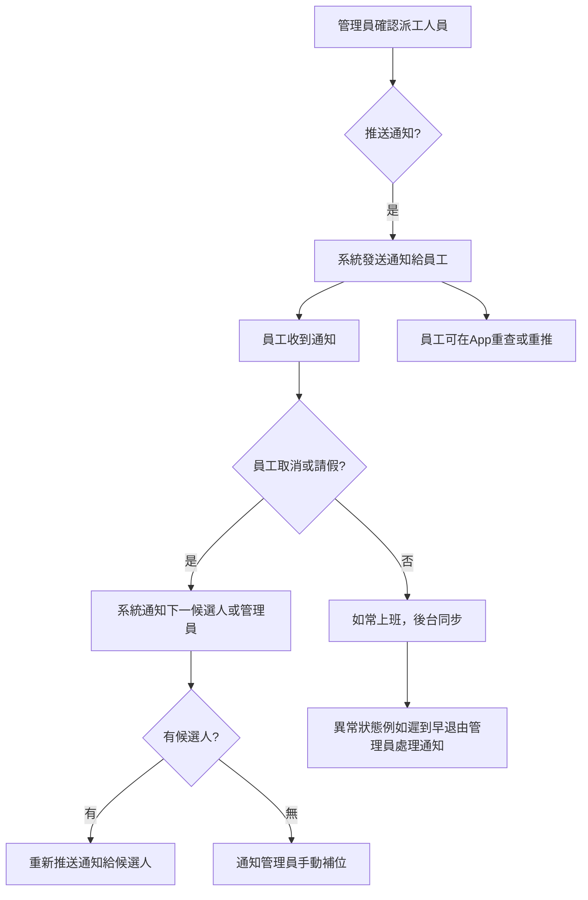

以下是整個業務訪談內容中**推送通知（Push Notification）流程**的歸納和拆解——重點只放在此子流程如何設計及現時做法：

***

### 推送通知基本流程

1. **確認工作分配後觸發通知**
   - 當管理員/派出單位完成「確認」誰負責某份工作（按下確認按鈕），即時推送通知給被選中的員工。這一刻就是通知行動的起點。【場景：確定誰去上班，系統要即刻通知他】

2. **通知方式與內容**
   - 現時首選WhatsApp API推送（或電郵等方式），把工作細節、地點、時間、注意事項等送到員工手機。【WhatsApp API推送】
   - 若有特別備註（如樓層、照片等），同時一併推播，保證員工第一時間收到完整資料。

3. **推送範圍及回應**
   - 當有多名候選人時，只有最終確認的人會收到工作通知。
   - 未獲選者一般不會在同一時段收到否決通知，只有在工作派發過程有變動（如第一人取消、補上第二候選人）時補發通知。

4. **取消／更改處理**
   - 員工如果於指定期限前（例如48小時內）申請請假或取消，系統會自動推送「取消通知」給下一待命人選或管理員。
   - 如屬超時取消，則會因紀錄需要，額外推送扣分（或特殊狀態）提醒給管理員。

5. **通知重推/重查**
   - 若員工忘記工作細節，可在App界面查閱最近的推送記錄或手動觸發重新通知。【設計上需保證歷史推送可查】

6. **多渠道配合**
   - 除了即時推送（WhatsApp、電郵、app訊息），重要事件（如請假/更換人手）須同步後台系統狀態，確保雙方都收到更新訊息。

***

### 流程步驟圖（概念）

- 派工確定 → 立即推送通知（WhatsApp/電郵/app）
- 員工收到通知 → 確認完成
- 請假/取消 → 自動推送通知（管理員 + 待命員工）
- 系統狀態更新 → 後台與員工app同步
- 員工可隨時查歷史推送或手動重推

***

### 特殊情境說明

- 若有多個人輪候，同一份工作 最多只推送給3人，同步控管通知量與公平性。
- 所有變動、取消與遲到等異常，都要推送相應原因通知給管理員/員工，支援人手補位或手動操作。
- 重要通知如派工/取消需有push記錄（伺服器留痕），方便事後追查或申訴。

***

以上就是本訪談中所涉及「推送通知（Push Notification）」流及設計重點，直接用於系統流程規劃或交付技術團隊落實。 若需詳細API、數據結構或邏輯循環，可根據上述流程拆分技術需求編寫spec。

Sources
