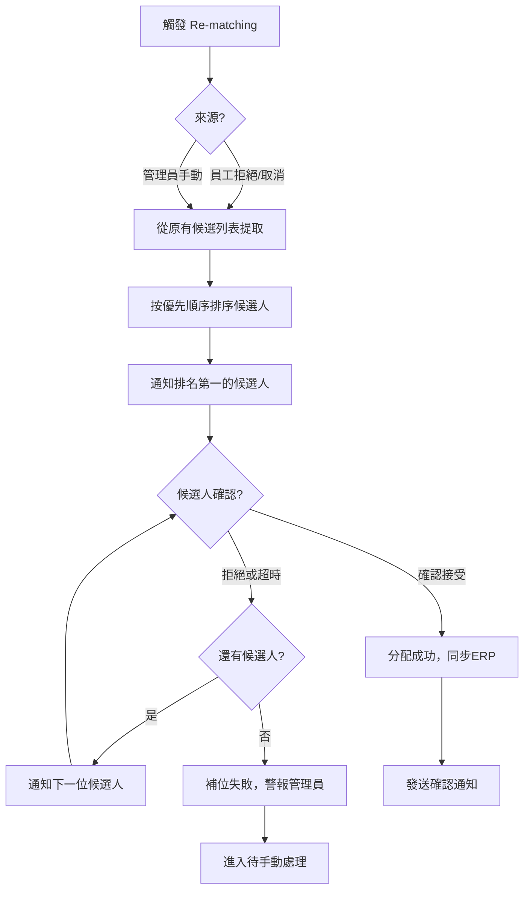

# Appendix F - Re-matching Flow (NEW)

**Document Version:** 1.0  
**Date:** December 8, 2025  
**Status:** New addition for enhanced job management  
**Replaces:** N/A

---

## 重要說明

**Re-matching Flow**：當員工拒絕分配或取消已確認班次時，系統自動重新匹配下一位候選人的流程。此流程確保班次快速補位，減少空缺時間。

**觸發條件：**
- 員工拒絕分配（2小時確認窗口內拒絕）
- 員工取消已確認班次（無論提前多久）
- 管理員手動觸發補位

---

## Re-matching 完整流程

### 1. 觸發 Re-matching

#### 自動觸發
- **員工拒絕：** 分配後2小時內員工點擊「拒絕」或超時未確認
- **員工取消：** 員工主動取消已確認班次
- **系統檢測：** 即時檢查班次狀態變化

#### 手動觸發
- 管理員在後台看到空缺班次，手動點擊「重新匹配」
- 適用於緊急情況或系統故障

### 2. 候選人排序與篩選

#### 從原有候選列表提取
- 系統保留原始匹配時的候選人排名列表
- 排除已拒絕或已確認其他班次的員工
- 按優先順序：
  1. Underlist 員工（曾服務該院舍）
  2. 分數由高至低
  3. 已接受班次數量較少（公平分配）
  4. 申請時間較早（先到先得）

#### 動態重新篩選
- 檢查員工可用性（無時間衝突）
- 驗證證書有效期
- 確認未達5個班次上限
- 排除黑名單員工

### 3. 自動通知下一候選人

#### 通知內容
- WhatsApp 模板消息：新班次補位機會
- 包含班次詳情（日期、時間、地點、聯絡人）
- 強調「補位機會」和確認期限（2小時）
- Web Push 通知（若員工在線）

#### 通知順序
- 從排名第2位開始逐一通知
- 每次只通知一位，避免混亂
- 如果前一位拒絕，立即通知下一位

### 4. 候選人確認

#### 確認流程
- 員工收到通知，點擊確認連結
- 進入確認介面，查看班次資訊
- 選擇：
  - **確認接受：** 立即分配，狀態更新為「已確認」
  - **拒絕：** 系統繼續通知下一位

#### 確認期限
- 2小時內必須確認
- 超時視為拒絕，自動通知下一位

### 5. 成功匹配或失敗處理

#### 成功匹配
- 員工確認接受
- 發送確認通知給管理員和院舍
- 同步至ERP（API 3.1 POST /api/v1/jobs/assignments）
- 班次狀態更新為「已補位」

#### 匹配失敗
- 所有候選人均拒絕或超時
- 系統標記為「補位失敗」
- 發送警報給管理員
- 班次進入「待手動處理」狀態
- 管理員可使用「緊急派發」功能直接指派

### 6. 通知與追蹤

#### 通知管理員
- 每次補位嘗試結果（成功/失敗）
- 如果補位失敗，立即警報
- 補位成功後，確認通知

#### 員工通知
- 補位機會通知
- 確認後的成功通知
- 如果被跳過（因前一位接受），無需通知

---

## Flow Diagram (Mermaid TD)

---

## 設計細節說明

- **自動化程度：** 全自動補位，無需管理員干預，除非失敗
- **公平性：** 維持原有排名順序，確保透明
- **效率：** 補位時間 < 5分鐘（通知到確認）
- **容錯：** 如果通知失敗，系統重試或標記
- **記錄：** 所有補位嘗試記錄在案，供審計

---

## 與其他流程的整合

- **Cancellation Flow：** 取消後直接觸發 Re-matching
- **Matching Engine：** Re-matching 使用相同算法
- **Notification Flow：** 使用相同通知模板
- **ERP Integration：** 補位成功後同步

---

**文件狀態：** ✅ 已完成  
**與 PRD 對齊：** ✓ 符合 Product Specification Document FR-2  
**最後更新：** 2025年12月8日</content>
<parameter name="filePath">/Users/user/Documents/GitHub/brain-storm/workflow-init/docs/09 - Appendix F - Re-matching flow.md